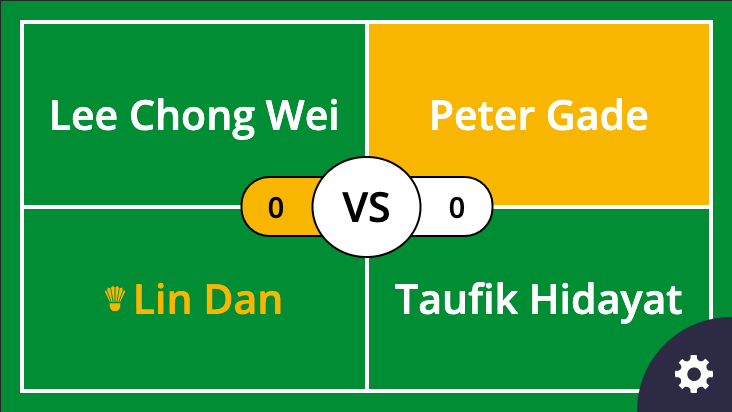

Struggling to learn the scoring system for Badminton? Need a professional looking scoreboard for an important match? Whatever your need for a Badminton scoreboard BadmintonsBest has a free to use [Badminton scoring app](/tools/badminton-scoring-app) that can be used on any web browser, no download needed!

<PillarSectionTitle theme="highlight">

  ## Beginner friendly and FREE to use

  

  Our [Badminton scoring app](/tools/badminton-scoring-app) is designed to help beginners learn how to score in Badminton. It shows who's serving, receiving and which side players should be standing on.

  Checkout our free [Badminton scoring app](/tools/badminton-scoring-app).

</PillarSectionTitle>

## Instructions for use

We've designed our app to be as intuitive as possible but we realise not everybody will find exactly what they're looking for first time round. So here's the full set of detailed instructions for use.

## Setting up a game

To setup a game simply choose the match type you'd like to score for.

The options are; mens singles, womens singles, mens doubles, womens doubles and mixed doubles.

Then simply enter the servers name, and for doubles their partners name. Enter the receiving players name and for doubles their partners name.

## Scoring points

To score a point simply tap the left or right side of the screen depending on which player/pair scored the point.

Currently the app will score using the current Badminton scoring system to 21.

We're looking at fleshing the functionality out more in the near future to include these features:

- Tracking a full match (best of three games to 21)
- Seeing the points timeline
- Resetting the current game/match
- Undoing the last point
- Exporting games as PDF/Excel scoresheets
- Remembering current data on browser refresh

<PillarSectionEnd
  content={[
    "So that's our scoring app, FREE to use!",
    "Please share this free tool if you found it useful",
    "Any improvments you'd like to see please leave a comment below",
  ]}
/>
