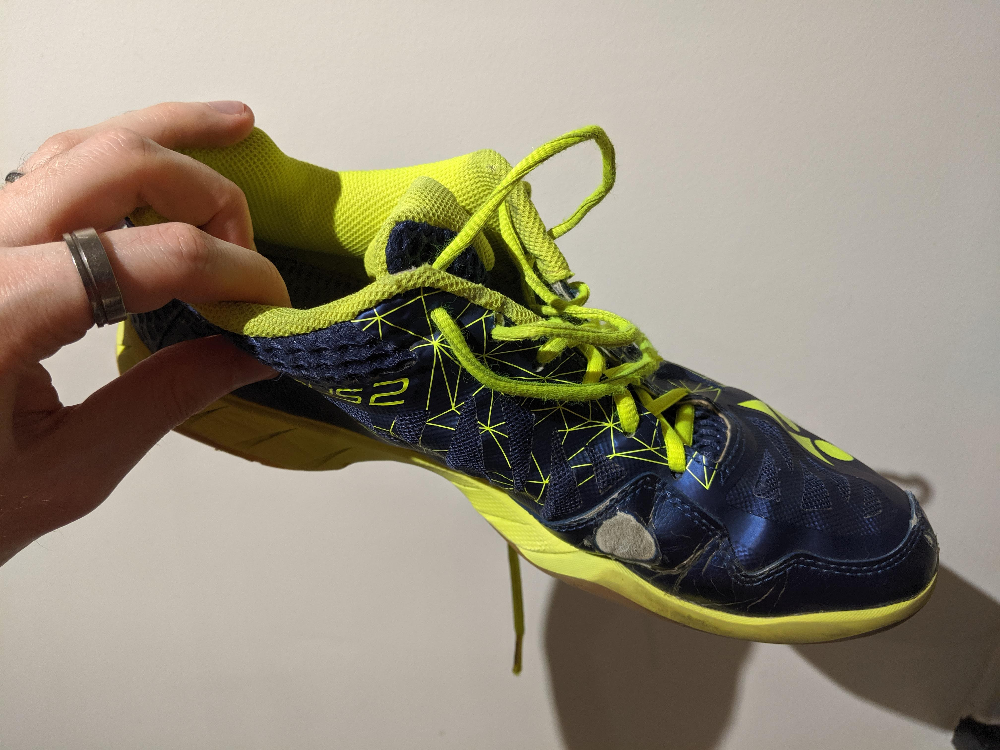

I’ve been fortunate that ever since I was young my father would buy me good quality Badminton shoes. He did his research and Yonex shoes were always at the top everyone’s lists. We were even luckier to be able to try on various models thanks to our local Badminton shop. I’ve been through countless pairs of Yonex shoes and yet people always ask.

Are Yonex Badminton shoes any good? **Yonex Badminton shoes are without doubt one of the best brands for Badminton shoes. They provide all the safety features for ankle support, shock absorption and rebound, anti-roll support etc. They’re comfortable, breathable, durable at price ranges to suit everyone.**

This is an honest review so I’m going to be outlining positives and negatives in all aspects. Let’s dive into detail everything I’ve learnt from wearing Yonex shoes and researching Badminton shoes.

## Comfort and feel

My Badminton shoes are by the far the most comfortable shoes I own. The fact that I only wear them for Badminton kinda sucks. I wish my everyday shoes were able to match the level of comfort Yonex shoes provide. Currently, I wear the Yonex Power Cushion 03ZM. Before that, I had a pair of Yonex Aerus 2s. They both fit comfortably without being restrictive.

Comfort is a big part of choosing the right Badminton shoes for you. I was able to at least try on all of my shoes before buying them thanks to a friend of mine who runs a small Badminton shop. Forget the brand and price tag, the shoes need to feel comfortable on _your feet_.

Yonex shoes go a long way in this category with features like the Power Cushion Plus to provide more shock absorption at the heel. Toe Assist Shape provides more space for the big toe to grip firmly when playing rather than butting up against the shoe. It also improves the fit in the midfoot and at the heel areas to reduce how much more foot slides whilst wearing the shoes.

Newer models of Yonex shoes have started to incorporate “inner booties” much like football shoes which provide more comfort than conventional tongues. These inner booties reduce the pressure on the top of the foot that usually comes from the laces.

Couple these with breathable fabric, quality lacing and eyelets, insoles that make you feel like you’re walking on air and you have a brand of shoe that is hard to beat.

The only downside is that with all of this great technology and design comes a bigger price tag. Yonex does have a great variety of shoes to choose from to cater for every budget.

## Wide and narrow feet fit

One thing I have found with Yonex shoes is that they tend to be narrower fitting than most. This is due to the design of the shoes and how they reduce side-to-side movement of the foot whilst wearing them. This is crucial to prevent blisters and to give you more control in your movement.

If you have wider feet or find shoes too tight-fitting it’s better to get a half-size bigger. After some wearing in you’ll find that Yonex shoe material relaxes more and will feel less restrictive without sacrificing the stability of your footing.

Some people find this a bit of a put-off but I find it’s players that only try a select few pairs of Yonex shoes that have this problem. The different models that Yonex make have different fits and I know the higher end models tend to be narrower to create a very snug fit for top athletes.

## Protection - feet, knees, legs and ankles

Another area where Yonex excels is the support and safety the shoes provide players. Yonex has always tried to innovate and lead the way in Badminton equipment. They’re not afraid to try new things to improve protection for players around the world.

The biggest feature of most Yonex shoes is the Power Cushion Plus technology. Their technology has such incredible shock absorption that they tested dropping an egg from 12 meters above small mat made from the Power Cushion (the same thickness as would be in one of their shoes) and the egg would bounce back without breaking. Check out the video below for proof.

<YouTube id="Cc-RflX7LtA" title="Yonex UK - The Power Cushion Egg Test" />

This shock absorption is so important because playing Badminton requires a lot of lunging and jumping which generate a lot of impact for the feet and legs to absorb. Yonex shoes negate a lot of stress that the player would otherwise take through their legs. This reduces the risk of injury in a number of areas including the ankles, shins, knees and hips.

Power Cushion doesn’t just provide protection but also provides a boost to performance as well. Power Cushion doesn’t just provide shock absorption but also repulsion to give the wearer better spring in their step.

Power Graphite technology by Yonex that comes in various iterations all provides more stability around the shoe to prevent twisting and rolling of the foot. Spraining your ankle in Badminton is one of the worst injuries that could happen to you. This happens most often when the player rolls their ankle and puts all of their weight onto the joint. Power Graphite helps in preventing this by providing support and stability around the foot and ankle to prevent rolling.

Power Graphite coupled with their TPU support provides even more support around the whole shoe and you great protection against the most common injuries from wearing unsuitable footwear.

## Durability and longevity

With all my years of experience with Yonex Badminton shoes, I’ve only had one pair that were a complete disappointment. There was a model they produced years ago which had a defect in manufacturing, it meant that the shoe leather split at the front of the shoe near the small toes. They barely lasted a month before I took them back to the shop and got a replacement pair, the same thing happened.

Apparently this wasn’t an isolated incident and Yonex quickly recalled the stock for faulty QA control. Every pair I’ve had before and since have lasted me _at least_ a year. See below the last pair of shoes I had, these Yonex Aerus 2 shoes lasted me three years!

They lasted three years through 3-4 nights a week of playing, training and competing. I’m nowhere near elite players standard but I get around the court better than most so they got a fair battering with me wearing them.

They lasted me through countless training sessions, regional competitions and many many club league Badminton matches. By the time I retired them they were still wearable but were starting to get some holes in areas and I didn’t want to keep wearing them with the chance of breaking and potentially injuring myself.

The laces were the main reason I retired them because they were about to snap! Three years of lacing on and off and the friction wore them down. This case study alone proves the durability and longevity that Yonex shoes provide.

## Are Badminton shoes necessary?

I’ve seen people play in regular trainers before, you see them running around and struggling with a lack of grip or just don’t look comfortable. I know Badminton shoes are a necessity, not just from a performance perspective but for all the reasons stated in this post. Trainers and other types of shoes like high-tops just don’t give you the support for Badminton when you need them.

Beyond safety and performance, there is another point to make. Having specific Badminton shoes stops outdoor dirt and mud from being spread onto the court from wearing shoes you’d also normally wear outside. You also won’t wear out your regular trainers with excessive wear and tear from playing Badminton.

There are brands that sell general indoor sport/court shoes which can suffice but a good pair of Badminton shoes are essential. It’s not a case of just going for Yonex either, there are lots of Badminton and sports brands that sell Badminton shoes. There is a shoe for everyone, have a look at our recommendations for the [best Badminton shoes](/recommended-gear/best-badminton-shoes/) to suit any budget for the seven best pairs.

## Related questions

### Are Basketball shoes good for Badminton?

Most Basketball shoes are high-top shoes, which means they come up past the ankle. This supports the ankle but reduces mobility which isn’t suitable for Badminton where you need flexibility around the ankle to twist and turn.

### Does Nike have Badminton shoes?

Nike doesn’t develop specific Badminton shoes per se but they do make indoor court shoes. These shoes are mainly designed for Tennis indoors but can be used for Badminton as well.

### What is special about Badminton shoes?

Badminton shoes have many design features optimised for playing Badminton. Features include; specific radial grip to provide traction in all directions, cushioned heel for impact absorption, the elasticity of impact material to provide bounce-back after landing. Read our blog on [Tennis shoes vs Badminton shoes](/blog/tennis-shoes-for-badminton/) for more detail.

If you found this article helpful return the favour and share it with a friend. If you feel I’ve missed anything out or have other advice, please leave feedback and share your help with others below. Thanks again for reading.
