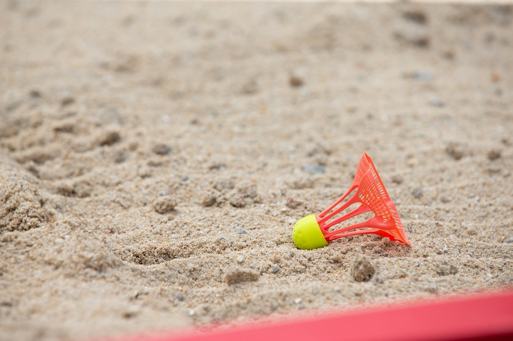

So you know someone who really loves Badminton. They live and breath Badminton. Christmas or their birthday is coming up and you don’t know what to buy them, well here’s 21 Badminton gift ideas for someone who loves Badminton.

1. **[Yonex Aerosensa 30s](#yonex-aerosensa-30s)**
2. **[Golden Retriever Badminton Dog Sticker](#golden-retriever-badminton-dog-sticker)**
3. **[Yonex Badminton Socks](#yonex-badminton-socks)**
4. **[Badminton Emoji Duvet Cover](#badminton-emoji-duvet-cover)**
5. **[Self Improvement Book](#self-improvement-book)**
6. **[Neon Shuttles T-Shirt](#neon-shuttles-t-shirt)**
7. **[Personalised Badminton Keyring](#personalised-badminton-keyring)**
8. **[Come to the Dark Side… Badminton T-Shirt](#come-to-the-dark-side-badminton-t-shirt)**
9. **[Badminton Medal Hanger](#badminton-medal-hanger)**
10. **[Pop Up Badminton Net](#pop-up-badminton-net)**
11. **[The NEW AirShuttle](#the-new-airshuttle)**
12. **[Tyrion Quote Badminton Mug](#tyrion-quote-badminton-mug)**
13. **[Badminton Solo Trainer](#badminton-solo-trainer)**
14. **[Shuttlecock Pattern Badminton Tie](#shuttlecock-pattern-badminton-tie)**
15. **[A Quality Microfiber Sports Towel](#a-quality-microfiber-sports-towel)**
16. **[Badminton Legends Poster](#badminton-legends-poster)**
17. **[My Neighbour Totoro Badminton T-Shirt](#my-neighbour-totoro-badminton-t-shirt)**
18. **[A Fancy Sports Water Bottle](#a-fancy-sports-water-bottle)**
19. **[Badminton Court Tactic Board](#badminton-court-tactic-board)**
20. **[Lord of the Strings T-Shirt](#lord-of-the-strings-t-shirt)**
21. **[Strong Muscle Massage Foam Roller](#strong-muscle-massage-foam-roller)**

21 great gifts to suit any Badminton player. So if you want to find then perfect gift then read on.

## Yonex Aerosensa 30s

The number one gift on this list will suit every Badminton player. No matter if they’re a casual player, competitive or professional player. Every Badminton player will appreciate having an extra tube of Yonex’s Aerosensa 30s’ in their bag.

Arguably the best brand of shuttlecocks you can get this gift is a sure winner. Buy them on [Amazon](https://amzn.to/2WpSjrh).

## Golden Retriever Badminton Dog Sticker

For all those Badminton lovers who also love dogs, you can buy this cute Golden Retriever Badminton dog sticker off of RedBubble. A lot of Badminton players love having accessories that can show their love of the sport in their everyday environment.

They might choose to decorate their Badminton bag, notebook or laptop with this cute sticker. It’s an easy stocking filler. Buy here on [RedBubble](https://www.redbubble.com/i/sticker/Preppy-Golden-Retriever-Badminton-Dog-by-emrdesigns/27945455.EJUG5).

## Yonex Badminton Socks

Badminton players talk constantly about the best Badminton racquets and the best shoes but what they’ll often take for granted is having high-quality Badminton socks.

Socks as a present won’t suck this time around as Yonex Badminton socks provide optimal comfort and breathability. Save your friend/family member from the blisters of ordinary socks and let them play in premium comfort. Buy them on [Amazon](https://amzn.to/35XYS7Q).

## Badminton Emoji Duvet Cover

Badminton players eat, sleep and breath the sport and with this new duvet set, they actually can sleep Badminton. They’ll not only get a good laugh out of it but also sleep easy knowing that you get them.

Now if only we could find edible shuttlecocks... buy here on [RedBubble](https://www.redbubble.com/i/duvet-cover/Badminton-Emoji-by-HippoEmo/28782110.XWIXB).

## Self Improvement Book

It’s no secret that Badminton players are always looking for ways to get better. They’re constantly watching videos and learning new skills to improve their game.

We have a guide recommending the [best books that all Badminton players](/recommended-gear/best-badminton-books/) should read. They’re not Badminton specific but the lessons and knowledge gained from these books will help them improve as a person and in turn as a Badminton player.

> Photo by Sharon McCutcheon on [Unsplash](https://unsplash.com/photos/eMP4sYPJ9x0)

## Neon Shuttles T-Shirt

Badminton themed t-shirts are going to be a trend on this list for good reason. Badminton players love them. Good design + badminton theme = perfect gift.

This neon shuttles design from RedBubble is a nice clean design with a good splash of colour. Perfect for that bright and cheerful Badminton player. Buy here on [RedBubble](https://www.redbubble.com/i/long-sleeve-t-shirt/Shuttlecocks-Colorful-Badminton-Sports-Serve-Racquet-Court-Racket-Rally-Gift-by-TomGiant/42481989.SOI2Z).

## Personalised Badminton Keyring

Not just Badminton themed but personalised for them. This Badminton keyring from Etsy is simple and elegant. Capturing their birth month birthstone, initial and a shuttlecock all in one gift.

They can use it for their keys or most players like to hang keyrings from their Badminton bag. Making this the perfect gift for those who like to add their personality to their Badminton gear. Buy it on [Etsy](https://www.etsy.com/uk/listing/735090420/personalised-shuttlecock-keyring?ga_order=most_relevant&ga_search_type=all&ga_view_type=gallery&ga_search_query=badminton+gifts&ref=sr_gallery-1-1&frs=1).

## Come to the Dark Side… Badminton T-Shirt

The Badminton force is strong with this one. For those Badminton fans who are also a fan of the force, this gift is for them. Badminton players are always looking to bring people over to the Badminton side and with this t-shirt, they won’t need Jedi mind-tricks to do it. Buy here on [RedBubble](https://www.redbubble.com/i/t-shirt/Badminton-Lover-T-shirt-Come-To-The-Dark-Side-by-funnyguy/33157843.IJ6L0.XYZ).

## Badminton Medal Hanger

This gift is for those Badminton friends who keep racking up the tournament and league wins. You know they’re good and they know they’re good. They’ve got medals and trophies collecting dust for years, well what if they had this amazing Badminton themed medal hanger.

It comes in a variety of sizes and its elegant design will suit any trophy wall. Let your Badminton buddy’s pride shine. Buy it on [Etsy](https://www.etsy.com/uk/listing/584177956/badminton-medal-hanger-sports-medal?ga_order=most_relevant&ga_search_type=all&ga_view_type=gallery&ga_search_query=badminton&ref=sc_gallery-1-3&plkey=6e7ddbdf9be41e8f2a2675ac07bc01e143aca613%3A584177956).

## Pop Up Badminton Net

I’m not going to lie if you mention backyard/garden Badminton to your friend they’re going to wince. It’s what all Badminton players dread hearing when people say they “play” Badminton. Having said that, in 2020 outdoor Badminton is going to be the way most people are playing for now.

Your friend will appreciate this portable net for simple practice in an open space. Esepcially when couple with the next gift on this list. Buy on [Amazon](https://amzn.to/2yFJ90Z).

## The NEW AirShuttle

Every Badminton player wants to get their hands on the AirShuttle right now. It’s a shuttlecock designed for the new outdoor Badminton format called [AirBadminton](https://www.badmintonsbest.com/blog/air-badminton-the-complete-guide/).

It’s designed for being played with outdoors unlike a traditional shuttecock which will fly around too much in the wind this AirShuttle will be more steady. Give them a fresh outdoor experience with the AirShuttle available at [AirShuttle.one](https://airshuttle.one/). More online shops to follow soon.

## Tyrion Quote Badminton Mug

Another great cross over gift, this time it’s Game of Thrones’ Tyrion Lannister. Everyone knows Tyrion is the smart and funny one. He has some of the best one liners in the whole show.

They’ll feel just as wise and witty as Tyrion with one sip from this mup. A Badminton player always pays his debts and they’ll owe you for this great Badminton themed mug. Buy here on [RedBubble](https://www.redbubble.com/i/mug/That-s-What-I-Do-I-Play-badminton-and-i-know-things-Funny-Badminton-by-handcraftline/40689215.9Q0AD?utm_source=google&utm_medium=cpc&utm_campaign=g.pla+notset&country_code=GB&gclid=EAIaIQobChMIvffQmtCT6QIVYIBQBh1b8Q6NEAQYBiABEgIujPD_BwE&gclsrc=aw.ds#&gid=1&pid=3).

## Badminton Solo Trainer

Another great gift for those Badminton players who just can’t get enough. Even when they have no-one around to play with Badminton players will still finds ways to play and practice. With this solo Badminton trainer they’ll have one more way to do that.

The solo trainer is perfect for player who want to practice some basic hitting drills that they’d struggle to do without a second person. Buy on [Amazon](https://amzn.to/2T0iZNh).

## Shuttlecock Pattern Badminton Tie

When they’re on court they mean business and when they go to work they mean Badminton… wait wha? Seriously, this Badminton patterned tie is perfect for the Badminton player trapped in an officer goers body.

Quality material with a minimal design keeps it professional and steers away from the horrible wacky, tacky Christmas ties people end up with. Buy it on [Etsy](https://www.etsy.com/uk/listing/260465700/navy-blue-tie-with-embroidered-badminton?ga_order=most_relevant&ga_search_type=all&ga_view_type=gallery&ga_search_query=badminton&ref=sc_gallery-1-1&plkey=f1866009768c93ea2eb835634d9b35b42ecdce81%3A260465700&frs=1).

## A Quality Microfiber Sports Towel

Badminton is a tough sport. At any level you’re going to work up a sweat. It’s always worth having a few towels in the bag to wipe down with. There’s nothing worse then putting on a fresh shirt after playing when you’re still sweaty. This towel is perfect for just that.

It’s super absorbent, fast drying and even comes in a little bag. This is an great gift for any Badminton player to have. Buy on [Amazon](https://amzn.to/3fM5B99).

<a
  href="https://www.amazon.com/Rainleaf-Microfiber-Towel-Inches-Green/dp/B01K1TX89Y/ref=as_li_ss_il?ascsub&cv_ct_cx=sports+towel&cv_ct_id=amzn1.osa.4f0c15e4-62a2-46dd-9ec7-7727c4e9cf8e.ATVPDKIKX0DER.en_US&cv_ct_pg=search&cv_ct_wn=osp-search&dchild=1&keywords=sports+towel&pd_rd_i=B01K1TX89Y&pd_rd_r=96493488-8b2d-4862-85b8-42df36413690&pd_rd_w=MHOwr&pd_rd_wg=QDRr4&pf_rd_p=ff28ffeb-0bd3-46bd-a00c-4c3cc2d00812&pf_rd_r=5QTFWXWMBGA3E8CVGP18&qid=1588370015&sr=1-2-32a32192-7547-4d9b-b4f8-fe31bfe05040&linkCode=li3&tag=badmintonsbes-20&linkId=b3c127669fc042115aad9d92f4df4e4d&language=en_US"
  target="_blank"
>
  
</a>

## Badminton Legends Poster

You might not know who these players are but I know that your Badminton friend does. A Badminton poster with some of Badminton greatest players they’ll be in awe when they unwrap this.

Featuring the “Four Kings of Badminton” Peter Gade, Lin Dan, Lee Chong Wei and Taufik Hidayat. This is the artwork your friend wants on their wall. Buy it here on [RedBubble](https://www.redbubble.com/i/poster/Badminton-Legends-Edit-by-RobSpink/25720476.LVTDI).

## My Neighbour Totoro Badminton T-Shirt

Everybody knows him, everybody loves him, it’s the Studio Ghibli mascot... Totoro! If your friend has any interest in both Badminton and anime they’ll love this t-shirt design.

Featuring the characters most iconic scene sheltering from the rain they won’t be able to stop grinning when they get this gift. Buy it here on [RedBubble](https://www.redbubble.com/i/top/Forecast-shuttlecocks-by-BadmintonM3rch/38723617.6AQD3).

## A Fancy Sports Water Bottle

Sports bottles are very trendy right now. You can get them is so many designs, they’re insulated to keep water fresh and cold and are dishwasher safe.

Badminton is thirsty work and nobody can go without having at least one of these in their bag. If they already have one no harm in having a second for around the house or work. Buy on [Amazon](https://amzn.to/365chuV).

## Badminton Court Tactic Board

This ones for the coaches. Trying to explain tactics and positioning can be a little tricky without telling people to stand here and there on court etc. This tactical coaching board is perfect for coaches.

It comes with magnetic markers, a pen and eraser. It’s perfect for coaches to clearly illustrate exactly what they mean to their players. Buy on [Amazon](https://amzn.to/2WpGKjN).

## Lord of the Strings T-Shirt

You shall not pass on this Badminton gift! Jokes aside, is there anybody who doesn’t like The Lord of the Rings. I think it’s a 99.99% chance your Badminton friend loves it. This Lord of Strings t-shirt will get a chuckle from any LOTR loving Badminton player. Buy it here on [RedBubble](https://www.redbubble.com/i/t-shirt/Lord-of-the-strings-funny-badminton-shuttlecock-by-Nessshirts/38322585.FB110).

## Strong Muscle Massage Foam Roller

Badminton’s tough on the body, you lunge, jump and stretch your body to the limit when you’re playing at your best. Badminton players need help with recovery and need a way to iron out all those kinks and they get day-to-day from playing.

This foam roller will be perfect for that Badminton lover who really needs to look after themselves. Their legs will thank you after getting a few uses out of this gift. Buy on [Amazon](https://amzn.to/3fGWgiZ).

## In Conclusion

Is there a Badminton gift I missed which you think is perfect? Let us know on Twitter, Facebook or Instagram. If you found this article helpful return the favour and share it with a friend.
