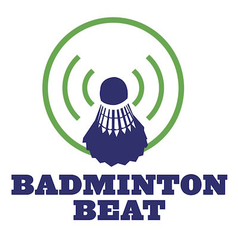
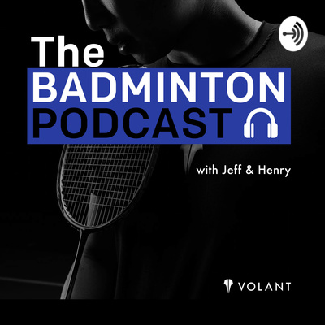

The trend for podcasts has been growing year on year without any signs of slowing down. People can listen to the news, educational content and discussions around almost any industry or hobby. They’re free and accessible to anyone with a smartphone or computer.

So what are the best Badminton podcasts out there? **The best Badminton podcasts in 2020 are:**

*   **Badminton Beat**
*   **The Badminton Podcast**
*   **BEC Podcast**
*   **A Year On Tour With Vittinghus**

These are the four best Badminton podcasts I listen to in 2020. This is not an exhaustive list of all the Badminton podcasts out there. A list of honourable mentions can be found at the end of this article. So, let’s see what makes these podcasts so great.

## Badminton Beat

The first podcast on this list the very first podcast I came across in my search for Badminton podcasts. One of the first podcasts covering Badminton, it’s also one of the most popular Badminton podcasts around.

Hosted by Mike De Belle and Kaz Tamasauskas, they’re two Badminton coaches and former international players from Canada. They run Granite Badminton club in Toronto and coach players of all levels.

Badminton Beat is a great podcast well suited for Badminton fans, players and coaches. They talk about the latest news in the Badminton world and talk about training methods as well as having guests from around the globe. They offer their insights on recent results and make predictions for the next big tournament.

Sadly, they don’t post as often as they used to but are still active with the last podcast episode airing in January 2020. They have nearly 40 episodes at the time of writing with episodes lasting from 30-60 minutes. There’s plenty of Badminton Beat content to get your Badminton fix for the day.

Links to the Badminton Beat podcast on various platforms and services below:

*   [Badminton Beat website](http://badmintonbeat.blubrry.net/)
*   [Google Podcasts](https://podcasts.google.com/?feed=aHR0cDovL2JhZG1pbnRvbmJlYXQuYmx1YnJyeS5uZXQvZmVlZC9wb2RjYXN0Lw&ved=0CAAQ4aUDahcKEwjIxqeQhtvnAhUAAAAAHQAAAAAQAQ&hl=en-GB)
*   [Apple Podcasts](https://podcasts.apple.com/us/podcast/badminton-beat/id1297809130)

## The Badminton Podcast

The next podcast on this list is very different from the rest of the Badminton podcasts out there. The Badminton Podcast is hosted by Jeff Tho and Henry Wong and they’re not your usual Badminton fans. As well as being players and coaches they’re Badminton entrepreneurs.

They founded their brand Volant Wear back in 2018 with the aim of producing the best looking and most comfortable Badminton apparel in the world. They saw a need for a brand that resonates with Badminton and non-Badminton players alike.

After founding their brand they also started The Badminton Podcast. Less than six months old at the time of writing and they have nearly 30 episodes already! Their podcast episodes range from 40-60 minutes but are regularly around 55 minutes long. Their value proposition is this:

_The podcast for badminton players, by badminton players, where we celebrate local heroes, interview players from all walks of life and push you to grow as a player and a person._

Their podcast delivers interviews with Badminton players we know and loves like Hans Kristen Vittinghus and Gronya Sommerville but they don’t just stop with interviewing players, they interview coaches, Badminton YouTube creators and high profile business executives that happen to be big Badminton fans.

Variety is the spice of life and this podcast is definitely spicy. Each episode brings new guests and new topic of discussion. If you want a Badminton podcast that talks about more than just Badminton then this is the podcast for you.

Links to The Badminton Podcast on various platforms and services below:

*   [Volant Wear website](https://www.volantwear.com/)
*   [Google Podcasts](https://podcasts.google.com/?feed=aHR0cHM6Ly9hbmNob3IuZm0vcy9jOGY5M2U0L3BvZGNhc3QvcnNz&ved=0CAQQrrcFahcKEwiQ4-iuitvnAhUAAAAAHQAAAAAQBQ)
*   [Apple Podcasts](https://podcasts.apple.com/us/podcast/the-badminton-podcast/id1481218876)
*   [Spotify](https://open.spotify.com/show/42fJTgrLWNJTFQ19AtMn04)
*   [Stitcher](https://www.stitcher.com/podcast/jeffrey-tho/the-badminton-podcast)
*   [Anchor](https://anchor.fm/thebadmintonpodcast/)

## BEC Podcast

Badminton Europe’s official podcast is one of the longest-standing Badminton podcasts on the market. Their podcast comes right from the heart of European Badminton, their podcast focuses on player and coach interviews and they have some of the best in the world on their podcast.

You typically know what you’re going to get from a BEC podcast episode so it’s exciting when they manage to get top players like Chris and Gabby Adcock and Michelle Li on the show.

They structure the episodes around the guests they have on with no particular topic attached. They ask questions about the players’ past achievements, where they are at present and their future goals and ambitions.

They have over 50 episodes lasting between 15-30 minutes long so are the perfect length for squeezing an episode into the morning commute.

Links to BEC Podcast on various platforms and services below:

*   [Badminton Europe website](http://www.badmintoneurope.com/Cms/)
*   [Soundcloud](https://soundcloud.com/user-298148835)
*   [Google Podcasts](https://podcasts.google.com/?feed=aHR0cDovL2ZlZWRzLnNvdW5kY2xvdWQuY29tL3VzZXJzL3NvdW5kY2xvdWQ6dXNlcnM6MzQ0NTE5OTgxL3NvdW5kcy5yc3M&ved=0CAAQ4aUDahcKEwjottW079vnAhUAAAAAHQAAAAAQAQ&hl=en-GB)
*   [Apple Podcasts](https://podcasts.apple.com/gb/podcast/bec-podcast/id1341621072)
*   [Spotify](https://open.spotify.com/show/121UMw4YXjOSjegFfRgQtR)

## A Year On Tour With Vittinghus

Last but definitely not least is the newest Badminton podcast on the block, A Year On Tour With Vittinghus. Like the title eludes to, this podcast comes straight from the Danish legend himself, Hans-Kristian Vittinghus.

Hans-Kristian Vittinghus is a top-level Badminton player who’s still playing in 2020. He’s been as high as number eight in the world and has numerous international titles, his biggest being the Australian Open in 2016. His most famous moment came when he won the final match for Denmark in the final of the Thomas Cup in 2016.

His podcast centres around his experiences on tour during 2020. It’s been an instant hit amongst fans of his and it’s the first podcast of it’s kind with fans being able to send questions in with the hopes of having it answered in a future episode.

I’ve been a long time Vittinghus fan so this review may be a little biased, but it’s worth listening to this podcast just to gain the insights of what touring on the international circuit is like for the top players in the world.

Links to A Year On Tour With Vittinghus on various platforms and services below:

*   [Podbean](https://vittinghus.podbean.com/)
*   [Google Podcasts](https://podcasts.google.com/?feed=aHR0cHM6Ly9mZWVkLnBvZGJlYW4uY29tL3ZpdHRpbmdodXMvZmVlZC54bWw&ved=0CAAQ4aUDahcKEwi4l-Wg8dvnAhUAAAAAHQAAAAAQAQ&hl=en-GB)
*   [Apple Podcasts](https://podcasts.apple.com/us/podcast/id1493710088)

## Honourable mentions

I couldn’t include all the podcasts I’ve listened to in my top picks so here is a list of three more that are worth mentioning but for one reason or another didn’t make the cut. Feel free to check them out if you’ve exhausted all other Badminton podcast avenues.

### Shuttletalk - Der Badminton Podcast

Shuttletalk is a weekly Badminton podcast presented by Tobias Wadenka and Kai Schäfer since September 2019. The podcast is presented in German so I can’t vouch for the quality of the content because I don’t speak or understand German.

I do follow [Tobias Wadenka’s YouTube channel](https://www.youtube.com/channel/UCfRMnJ4f02bKXts3OE8eOEw) however which is presented in English. His content on the YouTube channel is very good, aiming to teach people Badminton in more in-depth videos. If his podcast is as good as his YouTube channel then it’s bound to be a good podcast.

If you’re a Badminton fan that knows German then you can tune into episodes on [Anchor](https://anchor.fm/shuttletalk), [Google Podcasts](https://podcasts.google.com/?feed=aHR0cHM6Ly9hbmNob3IuZm0vcy9kZGRjM2Q4L3BvZGNhc3QvcnNz&ved=0CAAQ4aUDahcKEwi4qonb_tvnAhUAAAAAHQAAAAAQAQ&hl=en-GB), [Apple Podcasts](https://podcasts.apple.com/us/podcast/shuttletalk-der-badminton-podcast/id1480393878) and [Spotify](https://open.spotify.com/show/07eaNTD6PtxC0pLlvf2rYY).

### TV 2 Badminton

Sadly, another Badminton podcast that ended abruptly was TV 2 Badminton Podcast. Presented by Viktor Axelson the podcast spanned from 2017 to November 2018. The podcast is spoken in Danish so, again, I can’t vouch for the quality but some of the episodes feature the biggest Danish Badminton players like Peter Gade and Joachim Fischer Nielsen.

It’s almost impossible to get hold of now, the only place I could find this podcast now is on [Apple Podcasts](https://podcasts.apple.com/gb/podcast/tv-2-badminton/id1208934879). If you speak Danish, give it a listen and have a good trip down memory lane.

### The Mid-Game Interval

Another podcast that has had sporadic episode posting is The Mid-Game Interval. Presented by a group of Badminton fans this podcast has more focus around recent Badminton events and general Badminton banter then providing player interviews etc.

It’s a podcast more like listening to a group of Badminton friends from your local club. If they ramp up the production quality and polish the structure of each episode they could have something really different to listen to. Their episodes are available on [Anchor](https://anchor.fm/themid-gameinterval), [Google Podcasts](https://podcasts.google.com/?feed=aHR0cHM6Ly9hbmNob3IuZm0vcy9hYjg5ZjBjL3BvZGNhc3QvcnNz&ved=0CAAQ4aUDahcKEwiIuLrA_dvnAhUAAAAAHQAAAAAQAQ&hl=en-GB) and [Spotify](https://open.spotify.com/show/0RCdfPiOYtrXDn8E8ENmec).

If you found this article useful or know someone who might find this useful please leave a comment and share. If you feel I’ve missed anything out or have other advice, please leave feedback and share your help with others below. Thanks again for reading.