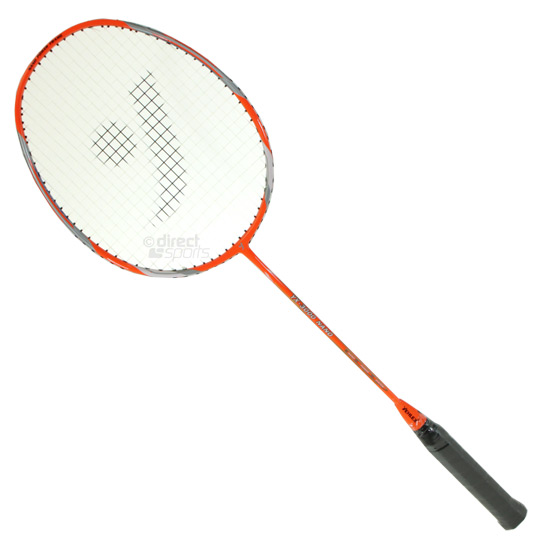
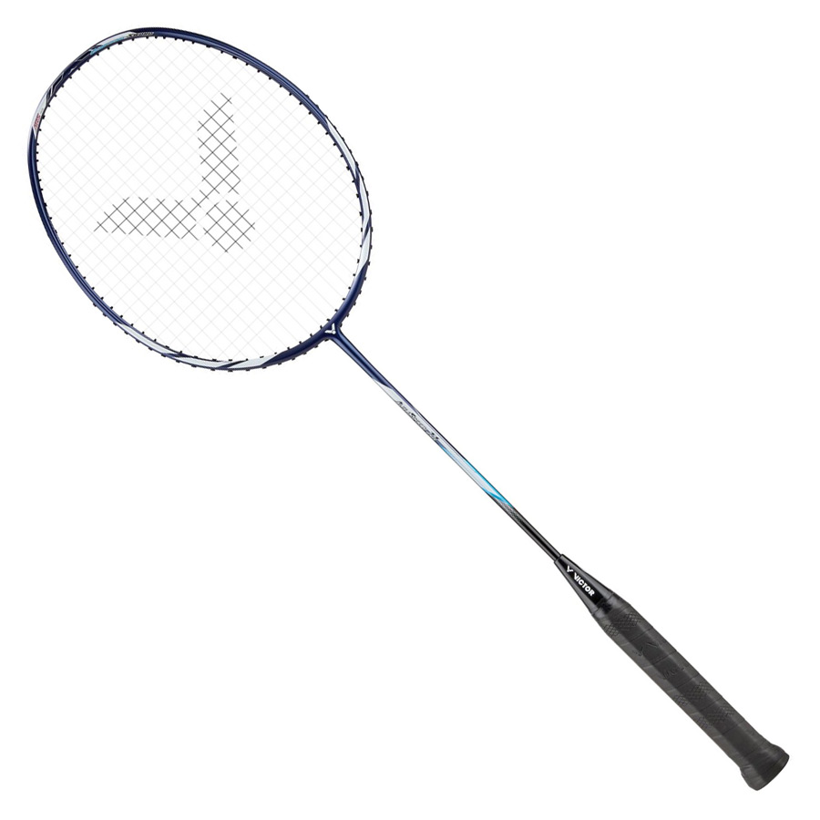

Just getting started playing Badminton? Not sure which racquet is best to start out with? Then you’ve come to the right place. In this guide, we’re going to give you the three best Badminton racquets for beginners. No matter how new you are or how you play, one of these racquets will suit you.

**The three best Badminton racquets for Beginners:**

- **Yonex Arcsaber Lite**
- **Yehlex YX-3000 Nano**
- **Adidas Spieler W09.1**

Read on to see why these three Badminton racquets are the best for beginners. Stick around till the end and we’ll tell you the factors we considered when picking these three and [how to choose a Badminton racquet](/blog/which-badminton-racquet-is-best-for-me/).

## Yonex Arcsaber Lite

Yonex is one of the most reputable Badminton brands out there. Their Arcsaber range of racquets is all designed for players who want to play with a lot of control. All racquets in the Arcsaber range are evenly balanced racquets which are perfect for beginners.

The shaft is a medium flex which gives it enough flexibility to generate power easily but without it feeling like Hollywood prop. It weighs just 83 grams so it’s nice and light, making it easy to control for any beginner.

The isometric head shape creates a larger sweet spot so mishits become a lot more forgiving on the strings for someone just starting out. The AERO Frame creates less drag when you swing so it feels nice and quick.

All in all a top quality racquet at a modest price. A no brainer recommendation for beginner players. Buy [here on Amazon](https://amzn.to/2USVEhy).

## Yehlex YX-3000 Nano

The best budget buy on this list is the Yehlex YX-3000 Nano. Yehlex has a long history of making quality racquets, not just for Badminton but Tennis as well. Boris Becker won his first Wimbledon title with [one of their racquets](https://www.yehlex.co.uk/pages/about).

A full carbon graphite build means it’s durable and lightweight. The isometric head shape offers a larger sweet spot for a more consistent clean hit for beginners. It sports a more flexible shaft than the Yonex Arcsaber Lite which means it’s even easier for beginners to generate power.

This is a very good budget racquet but beginners will soon outgrow it when they’re hitting more consistently and with more power. Good repulsion and evenly balanced, it ticks all the boxes. Buy [here on DirectBadminton](<https://www.directbadminton.co.uk/sport/badminton/badminton-rackets/yehlex-badminton-rackets/yehlex-yx-3000-nano-badminton-racket-(orange)?ProductID=23767>).

## Victor Auraspeed 11 B

Victor is another top global Badminton brand, arguably second only to Yonex. Their racquets are used by some of the best in the world and over the last 6-7 years they’ve really stepped up their game.

The Victor Auraspeed 11 B shows the quality build you can get even in a beginner racquet. Part of their Auraspeed range designed for fast responses and easy handling. It’s a racquet that isn’t quite evenly balanced, it leans slightly into being head-light but not drastically.

The flexible shaft helps beginners generate power easily and it’s a full graphite and resin model making it light and strong.

It is the most expensive racquet on this list but you get what you pay for which is a quality Badminton racquet. Perfect for any beginner who’s got a bit more to spend. Buy it [here on Direct Sports](https://www.directsportseshop.co.uk/dssport/badminton/badminton-rackets/victor/victor-auraspeed-11-b-badminton-racket?ProductID=37390).

## Choosing a racquet for a beginner

There are a number of factors that come into play when choosing a racquet. These are the **grip size, weight, staff flexibility and racquet balance**. These are always taken into account regardless of player ability.

Price can a factor for some people but not everyone. It’s normally best to get at least two of the same racquet so that when a string breaks then you have another to play with whilst you get the other one restrung. Keep that in mind when choosing your purchase but don’t let it be the deciding factor. Get the best racquet for you.

When choosing a racquet for a beginner you want a good quality racquet that won’t have an adverse effect on their development. Here’s what we look for in each category for a beginner Badminton racquet.

### Grip size

Badminton racquets come in different grip sizes. The sizes range from G2 being the thickest grip size to G5 which is the thinnest grip size.

For beginners, it’s best to start off with a G4 grip size. **G4 is the most common grip size Badminton racquets** come in, it is worth noting however that Victor branded racquet come in G5 as standard.

G4 is a good middle ground that should suit anyone. Not many people would need a thinner grip than this but some might need it slightly thicker. The best way to achieve this is to simply add a thin overgrip on top of the existing grip.

### Weight

Surprisingly each model of racquet a brand makes comes in various weights as well. These most commonly range from 2U to 5U. **2U is the heaviest version of that racquet and 5U being the lightest.**

4U is the most common weight retailers stock and is what we’d recommend for any beginner Badminton player. If you end up switching racquets at any point chances are it will also be a 4U weight class.

It’s got enough weight to carry momentum through your swing but not too heavy so it becomes tiring and difficult to play with.

### Staff flexibility

The long hollow shaft connecting the racquet handle/grip and the racquet head is arguably the most important factor to get right when choosing a racquet.

Badminton racquet shafts are made from carbon fibre much like the rest of the racquet. This makes them strong but also flexible and able to bend. Badminton shafts have varying degrees of flexibility. **These include extra stiff, stiff, medium flex and flexible shafts.**

For beginners, it’s important to get a racquet with either a flexible or medium flex shaft. The reason why is that the stiffer the shaft the more power and racquet speed you need to get the racquet to flex and generate power into the shuttle.

Beginners simply don’t have the technique to generate the racquet speed necessary to get the most out of the racquet. By choosing a racquet with a more flexible shaft it becomes easier to generate more power.

### Racquet balance

Every Badminton racquet has a balancing point. This is the point at which you can balance the racquet with one finger and have it balance horizontally without falling. The racquet balance can significantly affect the feel of the racquet and how it plays.

Badminton racquets usually come in three variants;

- Head-heavy
- Even balanced
- Head-light

When choosing a racquet for a beginner **I’d always go with an evenly balanced racquet**. Others might find this controversial and argue that players should embrace what feels good to them.

The problem is that when you’re just starting out there should be more focus on building technique and fundamental skills. Playing with head heavy or head light racquets can influence your technique greatly without you realising.

**Playing with a very head-heavy racquet could influence your racquet preparation.** Because the racquet has more weight towards the head the tendency is that players will start to drop their racquet in between shots because your body naturally doesn’t want to lift that up constantly.

On the flip side, **playing with a head-light racquet might produce poor technique** where you’re trying to swing too hard to generate more power. You have less momentum in your swing provided by the racquet so players try to overcompensate by swinging aggressively and without proper technique, this could lead to shoulder and elbow injuries.

### Want an in-depth guide?

Hopefully, this summarised mini-guide has helped you understand why we’ve picked the racquets we have on this list.

If you want to get a full picture and really understand all the factors in picking a Badminton racquet then check out our full guide on [how to choose a Badminton racquet](/blog/which-badminton-racquet-is-best-for-me/). We go through every aspect to consider when picking a Badminton racquet in much greater detail.

## Let’s wrap it up

So now you’re set! Get your racquet ordered and get stuck into Badminton.

If you found this information helpful, please leave a comment below and share on Twitter, Facebook or Instagram.
