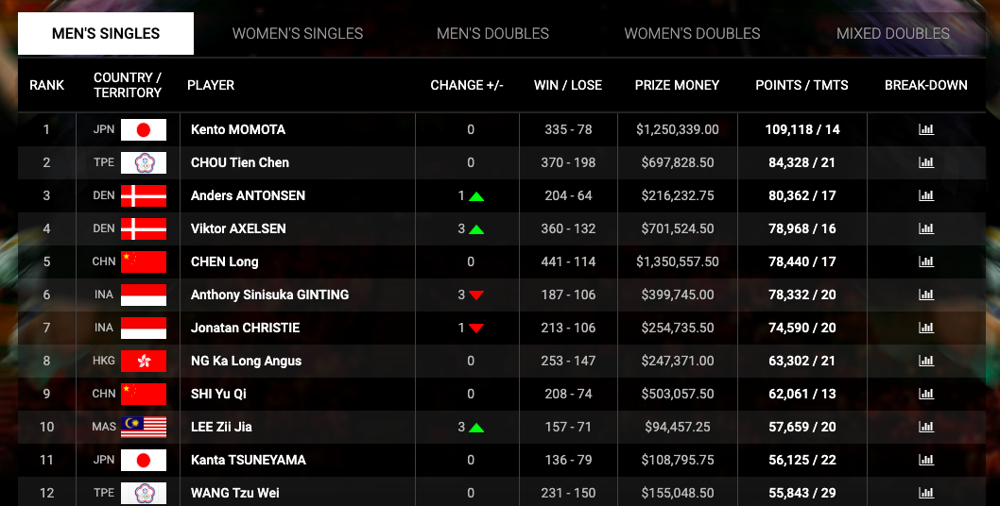
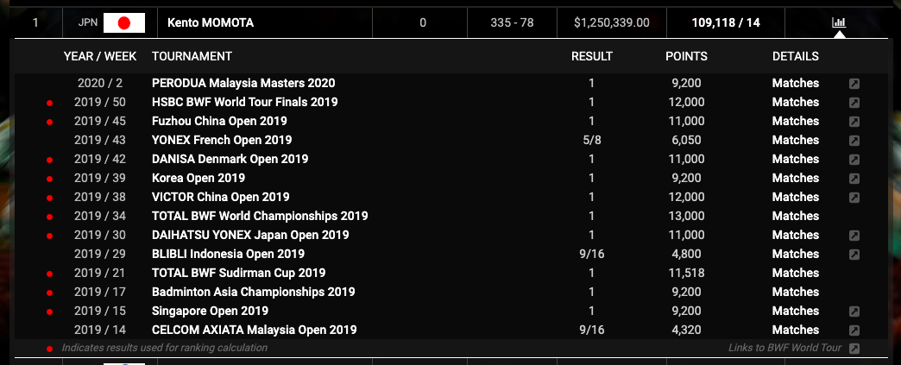

Badminton isn’t the richest sport in the world. Especially in western countries where there is little media coverage and where live sports are dominated by Football. You don’t see Badminton players in TV ads or [cameoing in movies](https://www.youtube.com/watch?v=SCIFLPWX2FM).

So how do Badminton player make money? **Badminton players make money with a combination of; through government funding, company/brand sponsorships, tournament prize money, playing in national professional leagues like the India Premier Badminton League and running side hustles/businesses.**

Some players use a combination of all of these methods and some only need to rely on a few. It’s different for players around the world. Let’s dive into the details of how they earn money through each method.

## Government/association funding

Not all Badminton associations have this luxury, so not all Badminton players will get support and funding from their national bodies. Most of the time their will be a national squad of players and at least those players will receive some funding.

China’s Badminton association receives a lot of funding and in turn, invests a lot of that into its training facilities, staff and players. Chinese Badminton players have [their living expenses paid for](https://www.sportskeeda.com/badminton/chinese-domination-badminton-reasons) so that they can focus solely on Badminton and becoming the Olympic prospects.

Badminton England lost all of their funding from UK Sport shortly after the Rio 2016 Olympics. Despite winning a bronze medal in mens doubles, something they had never achieved before. Read the full article on the [BBC](https://www.bbc.co.uk/sport/badminton/38270475).

<Tweet tweetId="809443208048627713" />

## Company sponsorships

This is a common one for most Badminton players and sponsorships can come in packages with various benefits. For the majority of sponsored players brands like Yonex, Victor and Li-Ning among others will provide players with full sets of equipment and clothing for free or at a heavily discounted rate. The rate of discount depends on the players’ reputation and current performance.

The players in return agree to promote the brand and use only that brands equipment for competitive play. They might also get affiliate commissions for referrals to associated stores, commissions for any promotional material used for sales featuring their image and name.

<Tweet tweetId="1235180856093954050" />

The very greatest players in the world might also be compensated with direct payments to them. It’s quite rare, limited to players like **Kento Momota** and **Lin Dan** etc.

Other clauses in sponsorship contracts can make it hard to attain higher-level sponsorships which mandate playing a certain amount of tournaments or making appearances at events.

## Tournament prize money

Badminton isn’t the richest sport in the world but tournament prize money is increasing year on year at the biggest tournaments around the world. All paid for Badminton tournaments have prize money of some kind.

Prize money earnings are determined by your result in the tournament. The biggest tournaments will award all the way back to the first round to cover entry fees but the lower tier tournaments will only start to pay out if you place in the **top 4-8 in the event**.

Have a look at the table below. This is the ranking list of the worlds top 12 Badminton singles players. Alongside there win/lose ratio and ranking points is their earnings via tournament prize money.

The number one in the world, **Kento Momota**, made just over **\$1.25 million in 2019**. The only other player to top a \$1 million is **Chen Long**. Kento Momota had to win 11 tournaments on the World Tour to make that much.

## Paid professional leagues - Malaysia Purple League, PBL

This is exclusive to the best players in the world. There aren’t many national on international leagues for Badminton and even fewer that pay for players for participating.

Malaysia’s Purple League pays players per match and according to an Indian Badminton Player, [Sumeeth Reddy in 2017](https://www.newindianexpress.com/sport/other/2017/oct/12/peeved-with-pbl-pay-sumeeth-reddy-considers-seeking-malaysia-break-1671700.html), players can earn around $15,000-$20,000 for the two months the league runs for.

For a lot of the professionals, this is just as much if not more then what they earn from tournament prize money for the year.

India’s Premier Badminton League is another renowned international Badminton league. Founded in 2013 the league had a different way of paying players. Teams each had a purse of **₹2 crore (US\$280,000)** to spend on players in an auction to build their team.

They had one condition which is that they couldn’t spend more than **₹77 lakh (US\$110,000)** on any one player. Whatever the player auctioned for was the salary they were paid.

<Tweet tweetId="1226740074710126593" />

## Private coaching

This depends on the players’ circumstances but some players choose to be a hybrid of both player and coach for others. Especially independent players who might not be supported by their national association.

Players have all the skills and knowledge to play Badminton which makes getting necessary coaching qualifications much easier. Working with other players on a one-to-one basis around their training schedule.

This isn’t necessary for most who get enough funding to train and play full-time. For those that might struggle this can be a relatively easy way to generate extra income to support their playing career.

The great thing about this is that it becomes a natural step for players to stay in the Badminton world after they’re finished with their professional playing career.

<Tweet tweetId="1166990556746190858" />

## Stringing racquets

Professional Badminton players go through a lot of racquets, both in training and during tournaments. They’ll often need to restring all their racquets every other week when training and even more so when playing tournaments.

Most Badminton players don’t need to restring their own racquets as coaches and other staff will normally handle it. Some choose to learn how to string and will offer basic stringing services for people they know or club players who live and play close by.

It’s not a big money earner but if they have the equipment and the know-how it can be a simple way to gain a little extra on a quiet evening. Most people will charge a flat rate for the restring coupled with the cost of the string used.

<iframe
  width="560"
  height="315"
  src="https://www.youtube.com/embed/RBViCtBwbV4"
  frameborder="0"
  allow="accelerometer; autoplay; encrypted-media; gyroscope; picture-in-picture"
  allowfullscreen
></iframe>

## Miscellaneous side hustle/businesses

This one isn’t exclusive to just Badminton players. Lots of people around the world right now are trying to skill up and diversify their incomes with **side hustles and businesses**.

Whether it’s selling crafty stuff on Etsy, designs on RedBubble, Spreadshirt and Teespring, shipping white label products with Amazon FBA or any one of countless other business models, people are looking to earn smarter.

Famous Irish Badminton player Scott Evans, now a coach at Peter Gade Badminton Academy, is also an entrepreneur. Running a fashion business along with his partner allowed him to keep competing for so long and move to Denmark to fully embrace top-flight European Badminton.

<iframe
  width="560"
  height="315"
  src="https://www.youtube.com/embed/nbZ6deQPejA"
  frameborder="0"
  allow="accelerometer; autoplay; encrypted-media; gyroscope; picture-in-picture"
  allowfullscreen
></iframe>

More and more players are starting to become content creators on YouTube. Take Viktor Axelson for example, alongside being one of the worlds best players he’s also publishing content on YouTube to teach and inspire others. Ad revenue might not be much but it all adds up.

<iframe
  width="560"
  height="315"
  src="https://www.youtube.com/embed/jZIO4ROnA0A"
  frameborder="0"
  allow="accelerometer; autoplay; encrypted-media; gyroscope; picture-in-picture"
  allowfullscreen
></iframe>

## That’s a wrap!

So that’s how Badminton players make money. If you found this information useful please like and share it on Facebook, Twitter and Instagram.

Leave a comment and let me know if you think Badminton players should be earning more. Thanks for reading.
