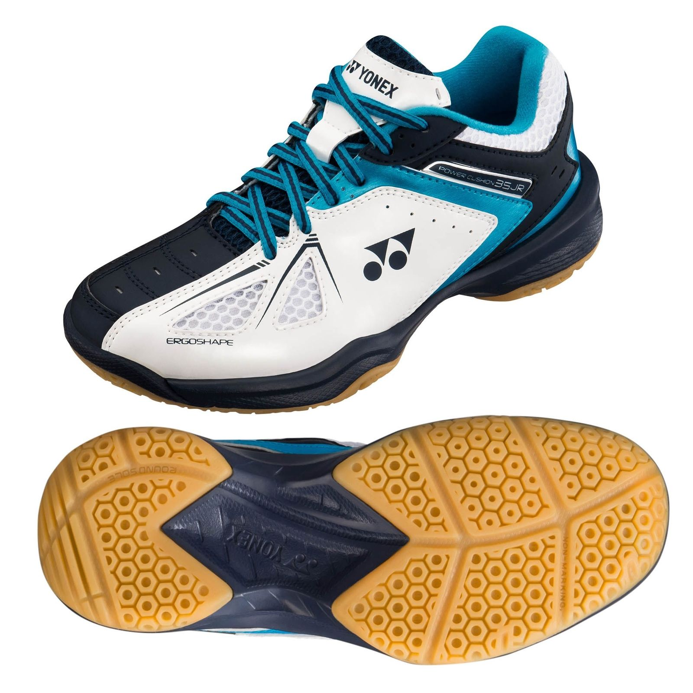

When I first started out playing Badminton, I played for fun, purely recreational. As soon as I started to get better and my father started taking me to a coach, we were advised I get a proper set of Badminton shoes. All sports have specialised footwear designed for the needs of that sport. I was just using my normal trainers for playing Badminton.

So can you wear Tennis shoes for Badminton? **The simple is yes you can but it's not advised. Some Tennis shoes are designed for all court types such as grass, clay etc but some are designed for one court surface like grass. These wouldn't be suitable for indoor Tennis let alone Badminton. Some Tennis shoes aren't designed to be non-marking either so they wouldn't be allowed indoors either. They also have a lot more padding in the heel which makes using them for Badminton difficult when you need to lean back for overhead shots.**

I would always recommend everyone playing Badminton to have Badminton specific shoes. They offer lots of benefits and there are shoes for every person and every budget. Let's look closer at why Tennis shoes aren't a good fit and why Badminton specific shoes are so worth it.

## Why Tennis shoes are not recommended

It goes without saying but Tennis shoes are designed for Tennis, go figure. It might be obvious but what specifically about Tennis shoes makes them suited for Tennis and not Badminton?

Firstly Tennis requires a lot of lateral movement (moving side to side). Tennis requires a lot of running along the baseline and you don't often have to run forwards to the net or backwards. So Tennis shoe grip is designed to grip more for this lateral movement.

The second difference is that Tennis shoes have a more heavily padded and raise heel like running shoes. This is to support the joints on impact as you run. Tennis footwork is more running than anything else whereas Badminton you chasse more. There are a few instances in Badminton when you run but they're less common. Tennis shoes are overall a lot heavier than Badminton shoes. You'll want to feel light on your feet when playing Badminton and shoes that feel heavy won't help with that.

As we mentioned Tennis is played on a variety of court surfaces which include grass, clay and hardcourts. Some Tennis shoes are designed for a particular surface to allow for more grip or less. The soles of Tennis shoes can be harder or softer than Badminton shoe soles depending on which court surface they're intended for. It's not often Tennis isn't often played indoors on a wooden surface so they don't make the shoe soles out of non-marking rubber as it's not needed.

The last difference in Tennis shoes is arguably the most important. The grip patterns on Tennis and Badminton shoes are very different. Because Badminton has you moving in all directions the grip patterns are designed to be radial. They grip strongly in whichever direction friction is applied. Tennis shoes have a variety of grip patterns. Clay court shoes usually have herringbone tread pattern (a zig-zag like pattern) that stops clay getting lodged. It also allows for controlled sliding whilst still giving grip. Grass court shoes have a pimply pattern and are only suitable for grass courts. They provide a lot of grip because grass is the most slippery court surface for Tennis. Used on other surfaces and they'd grip too much.

## Can I wear Squash or any indoor shoes?

Unlike Tennis shoes, Squash shoes are ok for Badminton. Squash has similar footwork and movements as Badminton. Squash requires speed and lots of changing direction much like Badminton. The shoes are designed for indoor use and the same grip patterns as Badminton shoes do.

Most styles of Squash shoes can be used for Badminton without a problem. Other general indoor shoes can be suitable but some may lack the ankle support you see often in good Badminton or Squash shoes.

## Badminton shoes, what's special about them?

So what makes shoes designed for Badminton special? It depends on the brand and model you go for but all Badminton specific shoes have radial grip patterns. This grip pattern allows for good grip when stressed in any direction.

Some models of shoes have either a layer of stiff material or what they call "talons" down the side of the shoe. These are designed to create stability for the foot and to prevent rolling. There is a lot of lateral movement in Badminton and these help players keep their footing.

Yonex designed the lightest pair of Badminton shoes in the world with the Aerus models. The weight of the shoe is key for fast footwork. They're also designed to fit the shape of the foot very snuggly. Wearing a good pair of Badminton shoes feels like wearing no shoes at all sometimes.

Minor detail but Badminton shoes are also designed to be breathable. Getting sweaty feet isn't great at any time but during Badminton, your feet can start to slide around in the shoes more and you're more likely to get blisters. Wearing the right socks and a good pair of breathable shoes will help lick the moisture away from your feet and stay dry.

## The best Badminton shoes for every budget

There are a lot of great Badminton brands out there. More sports brands typically known for other sports have started to dip their toes in Badminton gear as well. With brands like Yonex Victor, Li-Ning, Babolat, Yehlex and even Adidas there is a shoe out there for everyone.

I've personally always had Yonex shoes and only one model I've ever owned has been a dud. They promptly removed the model from the line due to a manufacturing error. Every pair I've had before and since have been superb and good quality for money.

Let's have a look at the best top of the range Badminton shoes out there currently.

### Top of the range (most expensive)

The Yonex Power Cushion Aerus 3 Shoes are one of the priciest shoes on the market. Made by the world famous brand Yonex, you can count on good quality from this pair. I've had the Aerus 2 shoes and have been by far the best pair of Badminton shoes I've ever had. This newer version improves on the previous model being even lighter and enhancing the durability of the shoe. They have all the latest features you'd want in Badminton shoes. They have great cushioning to support on impact, they're light, they fit the foot to prevent sliding and they have excellent grip among other features. This pair costs £109.99/\$145.34 <a href="https://www.amazon.com/Yonex-Power-Cushion-Aerus-Indoor/dp/B07HQZP6Z5/ref=as_li_ss_tl?dchild=1&keywords=yonex+aerus+3&qid=1585425482&sr=8-1&linkCode=ll1&tag=badmintonsbes-20&linkId=e586a7d62ba7be574d7a9967c4f53987&language=en_US" rel="nofollow">on Amazon</a>.

### Middle of the range (balance between cost and features)

The Yonex Power Cushion 03ZM Shoes are another great pair from Yonex. They look great, have more than enough support for the feet, excellent cushioning. They're specially designed for the laces to fit the shape of the foot better and reduce the pressure put on the upper foot from the laces. They've been discounted quite heavily since they're a model from the 2018 catalogue. They cost £79.99/\$105.70 currently <a href="https://www.amazon.com/Yonex-Cushion-Men%C3%A2%E2%82%ACs-Indoor-US11-5/dp/B06XHMZB82/ref=as_li_ss_tl?dchild=1&keywords=Yonex+Power+Cushion+03ZM&qid=1585425854&sr=8-1&linkCode=ll1&tag=badmintonsbes-20&linkId=fcf2c2b97dd71884ea4534ec09047fa5&language=en_US" rel="nofollow">on Amazon</a>.

### The low end of the range (the cheapest, best for beginners without sacrificing quality)

The Yonex Power Cushion 35 Shoes are Yonex's best answer for a budget shoe. Without skimping on the quality they have all the necessary features a Badminton shoe needs but without the bells and whistles. A great pair of shoes for anyone starting out with Badminton. This pair costs £39.99/\$52.84 <a href="https://www.directbadminton.co.uk/bproduct?ProductID=28330" rel="nofollow">on Direct Badminton</a>.

If you want a full list of options including multiple brands then head on over to our full buyers guide for Badminton shoes, click here.

## Related questions

**Can we use running shoes for Badminton?** We can't use running shoes for Badminton. Running shoes are custom designed for grip and support when running forwards or backwards. You don't get enough support for the ankle when twisting, turning and jumping in Badminton.

If you found this article helpful return the favour and share it with a friend. If you feel I've missed anything out or have other advice, please leave feedback and share your help with others below. Thanks again for reading.
