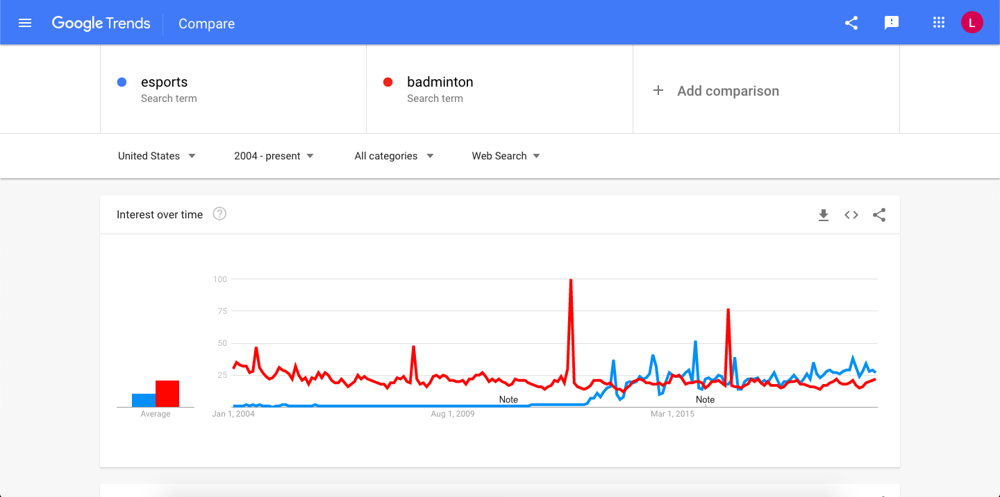
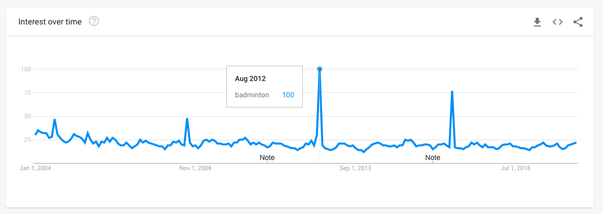

There are more than [220 million people](https://www.pledgesports.org/2017/06/top-10-most-popular-sports-in-the-world-by-participation/) who play Badminton around the world every single year. Despite that huge player base the interest in competitive Badminton really lacks in the US. You ask people about Badminton and they say “oh yeah, I’ve played that” and then you ask them who their favourite player is and they’re like… “favourite player?”.

So why is Badminton less popular in the US? **Badminton’s lack of popularity in the US accounts to; a lack of media coverage, a smaller player base, limited earning potential as an athlete, absence of well known relatable players, rare success in the sport at the top level and cultural history of sports in the US.**

We’re just scratching the surface with these points, read on to find out exactly why Badminton just isn’t so popular in the US.

## Badminton’s perception as a backyard/casual sport

Almost everyone has heard of Badminton and most people have played it at a family event like a BBQ in someone’s back yard. That’s as far as people’s perception of Badminton goes in the US. It’s something fun to play with their family and friends on a sunny day outside.

Now there’s nothing necessarily wrong with that but it means people don’t often get the full experience Badminton can bring. They miss out on the fast-paced rallies, the excitement and fun of mastering new skills and the satisfaction of outwitting your opponent.

They miss out on taking that next step and becoming true fans of the sports. A lot of people will watch sports like Baseball, Basketball and American Football and follow teams and players with fierce dedication, despite not even playing the sport themselves.

People aren’t aware that professional Badminton exists or simply aren’t interested in watching. They don’t know how exhilarating watching professional Badminton is, especially if the player you’re rooting for is in a tight game.

## A small player base

USA Badminton state on [their website](https://www.teamusa.org/usa-badminton/usab) that they currently have over 4,000 active members. They note that more than 1 million people play Badminton frequently in the US. For a country of America’s size that’s very low numbers indeed.

Smaller countries like England boast over 1 million people playing Badminton **per week! **Countries, where Badminton is far more popular like Indonesia and Malaysia, have numbers in the 10s of millions. In China, there are an estimated [100 million](http://www.badminton-information.com/why_does_china_dominate_in_badminton.html) people that play Badminton.

In a small country like Denmark, with a population of just over [5.8 million](https://www.google.com/search?q=denmakr+population&oq=denmakr+population&aqs=chrome..69i57.3683j0j1&sourceid=chrome&ie=UTF-8), they have over [90,000 active members](https://www.thelocal.dk/20180803/clubs-and-cold-weather-how-denmark-took-on-asia-at-badminton). That’s one in every 64 people in Denmark that have a membership, I’d imagine even more than that play without a membership to the association.

The US having such a small player base makes it that much harder to produce and raise enough funds to run events, tournaments and outreach campaigns. It’s harder to get quality coaches and pay them well enough to stay and raise top talent when they can go to other countries with more popularity.

## Tennis, Basketball, Baseball, Esports… so many options

> Photo by [Markus Spiske](https://unsplash.com/@markusspiske?utm_source=unsplash&utm_medium=referral&utm_content=creditCopyText) on [Unsplash](https://unsplash.com/photos/BfphcCvhl6E)

Probably one of the biggest contributors to the lack of popularity in the US is that people just have so many options. America doesn’t lack for facilities for all types of sports including Tennis, Basketball, Baseball, American Football, Soccer (Football for everyone else including me) and much more.

They have massive grass-root structures to get people into sports and get people playing early on in their childhood. These structures generate life long players, fans, volunteers, coaches and so on.

The emergence of Esports, especially for the younger generation, can’t be understated as another big influence. With games like Super Smash Bros Ultimate, CSGO, Overwatch, League of Legends and Fortnite producing massive followings for video games as competitive sports.

Esports has a very low barrier to entry as almost anybody can compete if they play the game. Players can practice from the comfort of their homes at any time. Most games don’t rely on you to having a set number of friends to play with either as you can be matched up online with other people around the world for quick practice.

> Photo by [Florian Olivo](https://unsplash.com/@rxspawn?utm_source=unsplash&utm_medium=referral&utm_content=creditCopyText) on [Unsplash](https://unsplash.com/photos/Mf23RF8xArY)

[Google Trends]([https://trends.google.com/trends/explore?date=all&geo=US&q=esports,badminton) shows that the popularity of the search for **Esports** in the United States has been on the rise ever since it’s emergence around 2013.

Badminton’s search trend shows big peaks during the summer Olympics but drops off dramatically once the summer games are gone.

## A lack of inspirational, relatable celebrities

**Ronaldo, Messi, Serena Williams, Roger Federer, LeBron James, Kobe Bryant.** These are all sporting names almost everyone has heard of. They’re known around the world even by people who have never watched them or played the sports they play.

If you ask the same people if they’ve heard of **Lin Dan, Lee Chong Wei, Peter Gade, Taufik Hidayat,** most of them will say no. Ask any Badminton player, fan or coach who they are and they’ll know straight away.

These Badminton legends get plenty of media coverage and publicity in their home nations and in Asia as a whole. In the US and Europe, these same names get little to no mainstream coverage at all despite their amazing achievements. Why is that? Well, I believe there are a number of factors come into account.

### Non-English speaking players

Out of the players listed only Peter Gade and Lee Chong Wei can speak English. Peter Gade is from Denmark and can speak fluently. Lee Chong Wei from Malaysia can speak English but doesn’t always look the most comfortable doing so.

Now I don’t think the ability to speak English should be a factor in this but it is. People find it hard to relate to one another when there is a language barrier. Things can get lost in translation and you don’t feel like you’re getting the character of the person in the conversation, especially if they need a translator.

### Badminton and nationality, the double-edged sword

If you look at how Badminton is presented in social media and TV coverage compared to other sports, one thing should stand out right away, the nation of the players is highlighted frequently.

People might forget that Roger Federer is Swiss and that Ronaldo is Portuguese because it rarely plays a factor when they compete. They’re never introduced alongside their home country and pundits rarely make note of their nation.

This detaches them from the potential patriotism that comes from routing for your own countrymen. People are fans of the individual rather than it being based on nationality.

**This patriotism is the double-edged sword of Badminton’s popularity.** On the one hand, you have amazingly passionate fans like the Indonesians that celebrate every victory of their home players. Players take great pride in representing their country at big events. Fans have a clear choice in who to cheer for even if they don’t recognise the players.

<Tweet tweetId="735029286525145088" />

On the other hand, you have whole nations who don’t have anyone to route for because of a lack of representation. They don’t see a potential self amongst the competitors at the top level. People choose the nation over the player regardless of player skill and personality.

### A lack of social prowess

There’s a big gap in following for Badminton players online. This partly stems from the patriotic approach to Badminton’s elite structures. Only people who are in the Badminton world will follow the likes of Victor Axelsen and Kento Momota.

For people outside of Badminton, they don’t see anybody interesting to follow. Players don’t have the outreach to entice people to follow them apart from Badminton fans. People will follow the likes of Ronaldo and Messi because they find something interesting about them worth following.

Players need to reach outside of just being Badminton players and showing more of who they are and their other passions in life. Chances are these other passions are more relatable to the masses.

## Where are the medals?

Less to do with popularity with players and fans and more to do with funding and publicity. The US has had little success at the top level of Badminton. The US’s success in the [first three Uber cups](https://en.wikipedia.org/wiki/Uber_Cup) in 1957, 1960 and 1963 and [Tony Gunawan’s World Title](https://en.wikipedia.org/wiki/Tony_Gunawan#IBF_World_Championships) in 2005 being notable exceptions.

Even then Tony Gunawan was originally from Indonesia and moved to the US around 2001. The US’s most notable player now is [Zhang Beiwen](https://en.wikipedia.org/wiki/Zhang_Beiwen) with her biggest win being the India Open 2018. Beiwen, like Tony Gunawan, isn’t a native American. She was born in China and moved to Singapore when she was 13. In 2013 she moved to the US and has been representing the US ever since.

Even with these past champions, the US lacks the most significant medal for almost all sports, the Olympic golds. Olympic success if vital for a lot of sports, including Badminton, to secure funding in order to compete, to grow, to build sustainable grass-root systems and so on.

A lack of medals is a big factor in the US being able to generate world-class players and with that more popularity for the sport.

## No media coverage = no awareness of the sport

We’ve touched upon this in other sections but it’s worth highlighting in full. Badminton gets no media coverage in the US except during the Olympics.

You can see on this Google Trends graph below, a massive spike in interest around July-August 2012. The data tells us that period in time was the most popular time people were searching the word “Badminton” online.

There’s no coincidence that this coincides with the controversy that happened at the 2012 London Olympics. The controversy surrounded womens doubles pairs deliberately trying to lose a group match to avoid playing a stronger seed in the next round. [Eight players were disqualified](https://www.bbc.co.uk/sport/olympics/19072677) and it caught the media attention everywhere.

The lack of media coverage hurts Badminton in two ways:

1. People don’t get to see Badminton for what it _can_ be
2. People don’t realise professional Badminton is a thing

So many other sports dominate the mainstream audiences of America and it becomes impossible for Badminton or other sports to get their foot in the door.

## Low player earning potential

For players to take up a sport as a career they need to generate a decent income to pay for coaching, equipment, travel, tournament entries and so on. This can become a big factor in whether a talented athlete decides to pursue a career in the sport.

Have a look at the table below. This is the ranking list of the worlds top 12 Badminton singles players. Alongside there win/lose ratio and ranking points is their earnings via tournament prize money.

The number one in the world, Kento Momota, made just over $1.25 million in 2019. The only other player to top a $1 million is Chen Long. Kento Momota had to win 11 tournaments on the World Tour to make that much.

Take this in contrast to Tennis where Novak Djokovic earned over **[£2.3 million](https://www.wimbledon.com/pdf/Championships2019_Prize_money.pdf) (\$2.8 million)** for winning just Wimbledon alone in 2019. That’s more than double the prize money for one tournament win vs 11!

That’s a wide gap in terms of prize money but I doubt Kento Momota would complain too much. However, the problem comes when you start looking further down the list, especially past the **top 20** and see that players are only **earning an average of $50,000-$100,00** in prize money.

Still high five-figure earnings but players after the **top 30 can be earning less than \$20,000** in prize money. You take tournament entry fees, travel, accommodation, paying for private coaches, physios and everything else that comes with professional sports then Badminton can be less than profitable.

Now players don’t just live off of prize money, they also receive sponsorship deals and brand deals. These can make a big difference in earnings for the year. Take P.V Sindhu for example, the current world champion in womens singles. She earning just over **\$500,000 in prize money** in 2019 but more than **\$5 million in endorsements** according to [Forbes](https://www.forbes.com/sites/kurtbadenhausen/2019/08/06/the-highest-paid-female-athletes-2019-serena-and-osaka-dominate/#7ddd71562fcc).

She made ten times more revenue from endorsements compared to prize money. Sadly, she is the exception in the Badminton world. She’s the only Badminton player to appear in Forbes top 15 highest-paid athletes for 2019, man or woman.

Badminton players rarely get endorsements from brands and in the US this is probably even rarer. So unless you’re top of the world, the chances of making big money in Badminton for an American player is relatively low.

## Cultural history

Almost every country in the world has its own history of sports. In the US sports like baseball, basketball and American football have deep roots embedded into its society. Massive stadiums with professional clubs just for each of these sports alone.

The US has a long history with each of these sports and prides itself with having some of the best players, teams and leagues in the world for these professional sports.

Badminton doesn’t have the same history in the US. Partly down to their success in other sports but also due to the accessibility and joy of people pursuing outdoor sports they can play with others.

In contrast, a country like Indonesia, where Badminton is a massive professional sport, has just the opposite. They have more facilities suited for indoor sports to escape the intense hot climate and less infrastructure for outdoor sports in general.

The other reason is that Indonesia has enjoyed enormous success in Badminton. They pride themselves on their Olympic heroes and rightly so. Badminton is Indonesia’s most successful sport at the Olympics where they’re only second to China.

<YouTube id="jIYsUcboLUo" title="Olympic Channel - Land of Legends" />

## Wrapping things up

The reasons I’ve elaborated on here are also the same reasons why Badminton popularity lacks for other western countries as well. Badminton’s popularity will always be a topic of discussion and I hope you found this information eye-opening.

Please share this on Facebook, Twitter or Instagram if you found it interesting. Let me know your thoughts on Badminton’s popularity in the US. Have any more information to share? Let us know in the Twitter thread below.
